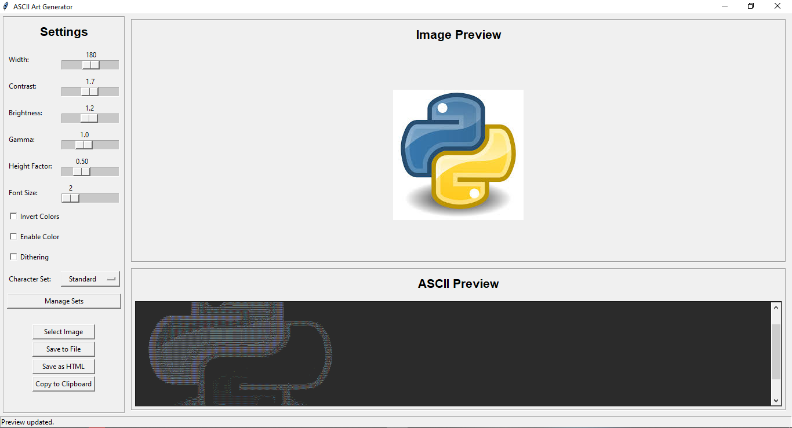

# 🎨 ASCII Art Generator  

   
  
  

## 📌 Overview  
The **ASCII Art Generator** is a Python application that converts images into ASCII art. It comes with a Tkinter-based GUI, allowing you to load images, tweak settings, and export ASCII art as text or HTML. It supports both monochrome and colored ASCII output with customizable character sets.  

> ⚡ **Note**: Color mode applies per-character RGB coloring and is computationally intensive. It’s recommended for mid-range and high-end PCs.  

---

## ✨ Features  
- 🖼 **Image to ASCII Conversion** (PNG, JPG, JPEG, BMP, GIF)  
- 🎛 **Customizable Settings**: width, contrast, brightness, gamma, height factor  
- 🎨 **Color Mode, Inversion, Dithering** toggles  
- 🔠 **Character Sets**: Default & custom sets (add, edit, delete)  
- 👀 **Real-time Preview** (image + ASCII art side by side)  
- 💾 **Export Options**:  
  - Save as `.txt`  
  - Save as `.html` (colored ASCII)  
  - Copy to clipboard  

---

## 📷 Screenshots  

**Main GUI:**  
  

**Example Output (Text Mode):**  
```txt
@@@@@@@@%%%%%%%%########********+++++++========-------
@@@@@@@@%%%%%%%%########********+++++++========-------
```

**Example Output (Color Mode):**  
  

---

## ⚙️ Installation  

### 1. Clone the Repository  
```bash
git clone https://github.com/pasindu21hl/ASCII-Art-Generator.git
cd ASCII-Art-Generator
```

### 2. (Optional) Create a Virtual Environment  
```bash
python -m venv venv
source venv/bin/activate  # On Windows: venv\Scripts\activate
```

### 3. Install Dependencies  
```bash
pip install -r requirements.txt
```

### 4. Run the Application  
```bash
python ascii_art_generator.py
```

---

## 🚀 Usage  

1. Launch with `python ascii_art_generator.py`  
2. Click **Select Image** to choose a file  
3. Adjust settings (width, brightness, contrast, gamma, etc.)  
4. Toggle color / inversion / dithering via checkboxes  
5. Preview updates in real-time  
6. Save results:  
   - **Save to File** → `.txt`  
   - **Save as HTML** → colored `.html`  
   - **Copy to Clipboard**  

---

## 📂 File Structure  

```
ascii-art-generator/
├── ascii_art_generator.py   # Main application
├── requirements.txt         # Dependencies (Pillow, NumPy)
├── assets/                  # Images, screenshots, sample outputs
```

---

## 📌 Notes  

- ✅ Tkinter is included in standard Python distributions.  
- 🐧 On Linux, you may need to install it separately:  
  ```bash
  sudo apt-get install python3-tk
  ```  
- 🎨 Color mode is resource-heavy → best on systems with **8GB+ RAM** & multi-core CPUs.  
- Uses **Floyd-Steinberg dithering** for improved grayscale conversion.  

---

## 🤝 Contributing  

Contributions are welcome!  
1. Fork the repo  
2. Create a feature branch (`git checkout -b feature-xyz`)  
3. Commit changes (`git commit -m 'Add feature xyz'`)  
4. Push to branch (`git push origin feature-xyz`)  
5. Open a Pull Request 🚀  

---

## 🙏 Acknowledgments  
- [Pillow](https://python-pillow.org/) for image processing  
- [NumPy](https://numpy.org/) for array operations  
- Classic ASCII art techniques for inspiration  
